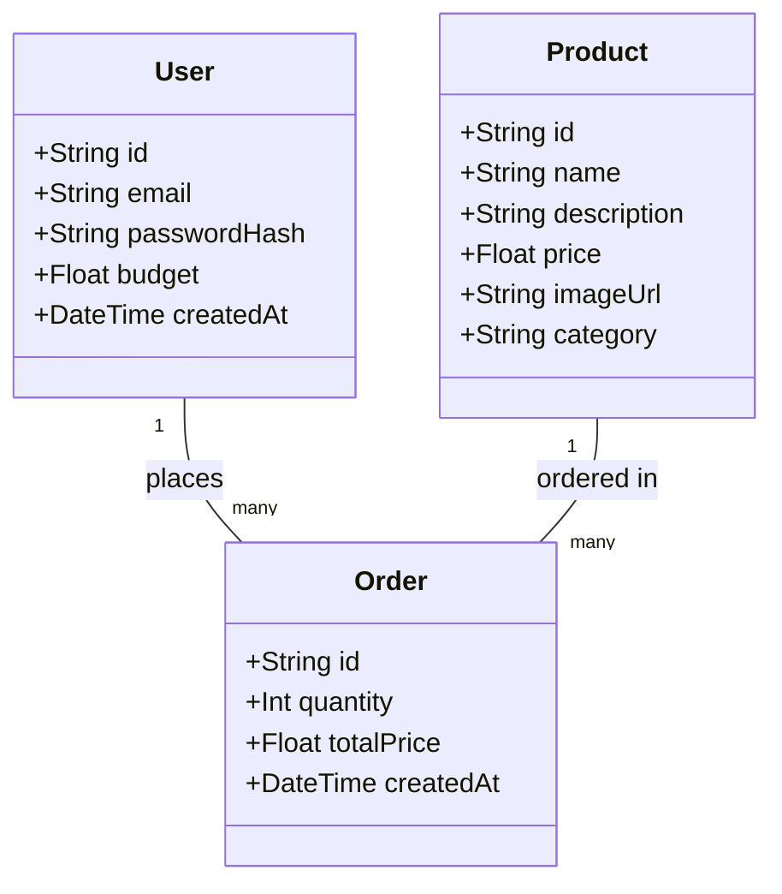

# Data Model

The app needs to remember three kinds of things: **who's buying**
(User), **what's for sale** (Product), and **what got bought**
(Order). An Order is the link between a User and a Product — it
records that a specific user bought a specific product, how many,
and for how much.

## In plain English

**User** — one row per person who can log in. Stores their email and
a *hashed* password (never the real password — see below), plus a
`budget`: the amount of money they're allowed to spend, starting at
$2,000.

**Product** — one row per item in the catalogue: name, description,
price, an image, and a category (e.g. "Living Room"). Right now this
is seeded with 8 placeholder furniture items; when a real catalogue
is ready, these rows just get replaced or synced from that source —
nothing else in the app needs to change.

**Order** — one row every time a user places an order. It doesn't
duplicate the user's or product's info; it just points at *which*
user and *which* product (`userId`, `productId`), plus details
specific to that purchase: how many (`quantity`) and the total price
at the time of purchase (`totalPrice` — stored separately from the
product's current price, so if a product's price changes later, past
orders still show what was actually paid).

**Why a separate Order table instead of, say, a list of purchases on
the User?** Because a purchase involves two things at once — a user
*and* a product — and either side can have many of the other: one
user places many orders, one product appears in many orders. A
dedicated Order table is the standard way to represent that
"many-to-many, but each with its own details" relationship.

**How the remaining budget is calculated:** it isn't stored directly.
It's `budget` minus the sum of `totalPrice` across all of that user's
orders, calculated on the fly. That way there's only one source of
truth (the orders themselves) instead of two numbers that could ever
drift out of sync.

This matches what's implemented in [`prisma/schema.prisma`](prisma/schema.prisma).
